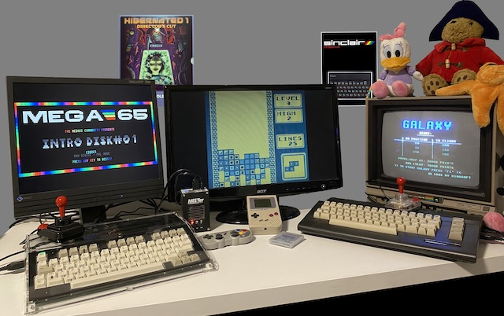

## What are "alternative" MEGA65 cores?

From day one, the [MEGA65](https://mega65.org/) was designed to be the spiritual successor of the legendary Commodore 65. To realize that goal and stay future proof, the MEGA65 is based on something called a FPGA - "Field-programmable Gate Array". Think of it as "programmable hardware". Usually the CPU inside a computer is pure hardware: It is manufactured and can't be changed by a user. An FPGA can be (within technical limits) any CPU you imagine and so can, like a chamelon, literally become a C64, Arcade Machine or Gameboy.

This is not what people usually refer to as **emulation**. An Emulator is a program that runs on a CPU and translates each command into instructions the CPU can understand. It's like have a translator at your side when you do not speak the language. An FPGA runs the code as if it IS that CPU. The analogy is that you learn the language yourself and can speak it like your mothers tongue.

Recreation of retro hardware via FPGA is not perfect. While most of the weirdest details can be identical to a real machine, there still are some obscure effects that might have fallen through the cracks. Still, because the timing of all the components in the FPGA is much closer to the real thing than in emulation, you usually get an extremly high fidelity.

So, an "Alternative" Core is basically a new language for the FPGA inside the MEGA65. It turns it into a different system. The MEGA65 has seven "slots" so you can immediately switch between them, and you can reprogram those slots with any of the Cores seen on these pages.

Oliver Graf aka _lydon_ made a [great YouTube explanation video](https://youtu.be/9Ib7z64z9N4) about recreating retro systems using FPGAs,
about the awesome MiSTer project and about the difference between MiSTer and the equally awesome MEGA65. Watch the video before reading on here, as it will provide you with valuable context.

## Can I run other FPGA-based Cores on MEGA65?

Unfortunately you can not take FPGA Cores written for MiSTer or the Analogue Pocket and run them straight on the MEGA65, but it is possible to convert Cores written for other systems. Please refer to the page [Creating new Cores](creating-new-cores-for-mega65.html) for more details.

## I have additional questions!

The best place to discuss is the MEGA65 Discord and the specific channel for Alternate Cores, which can be found here:

https://discord.com/channels/719326990221574164/1177364456896999485

Additionally you can try the MEGA65 discussion board here (mainly in German language):

https://www.forum64.de/index.php?board/457-mega65/

## Can I add a core to this list?

I am checking the MEGA65 filehost regularly for Core updates and try to update this list within a matter of days, if not hours. If for any reason I have missed an update or you have a release that is not available on the file host, write me an E-Mail to boris@dreisechzig.net. Updates on Work-in-Progress are also very welcome.