The MEGA65 can also be turned into an arcade game machine. As many early arcade games rely on fast reaction times, an FPGA-based recreation is much more faithful than software emulation. Unfortunately, arcade games usually require a complete FPGA slot for a single game.

## Important Details about Arcade Games

To recreate the game two parts are needed: An FPGA Core and image files for the ROMs. The Core is like a Core for a home computer and only has the "hardware" part of the machine. It still requires the actual software, which is a seperate file, even if the Core can only play one specific game. Arcade Game ROMs are available in many flavours on internet, but the Core usually requires a very specific format. You need to read the instructions per Core very carefully and follow them to the letter to create the correct files. This in some cases requires _Python_ on your computer. Due to copyright and licensing reasons, there is no official archive where Cores and ROMs are bundled ready to use.

Some Arcade Machine Cores support "DIP Switches". This refers to the switches on the arcade board itself and these are shown on screen. **Do not open the MEGA65 to change the DIP switches inside.**

# Cores Available for all MEGA65

## Bank Panic
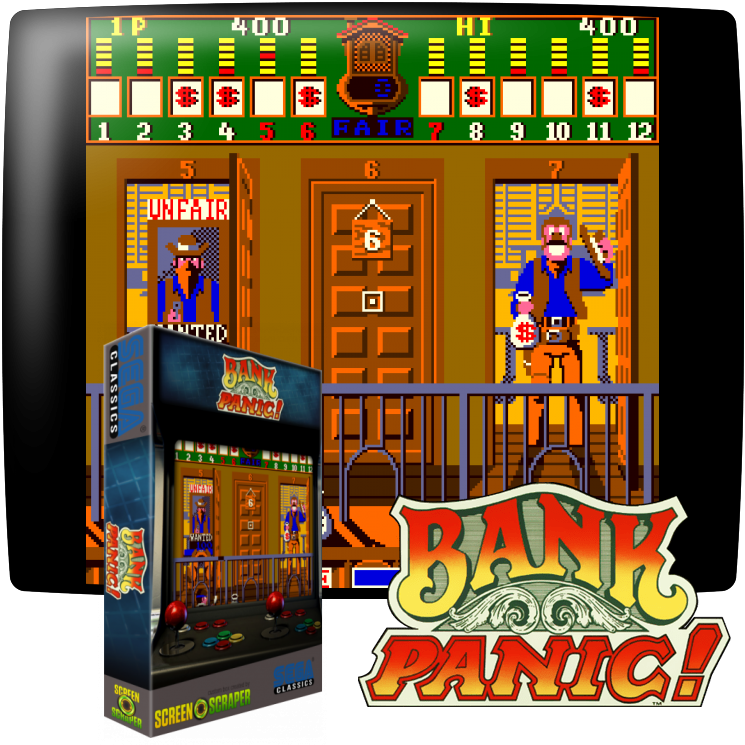
Bank Panic is an Arcade game by Sega from 1984.

https://en.wikipedia.org/wiki/Bank_Panic

Please follow the exact installation instructions from here:

https://github.com/sho3string/BankPanicMEGA65_R3_R6

Download the Core from the MEGA65 filehost here:

https://files.mega65.org/?id=36b41376-b2c6-45e6-a441-cd126357fdd4

## Bomb Jack
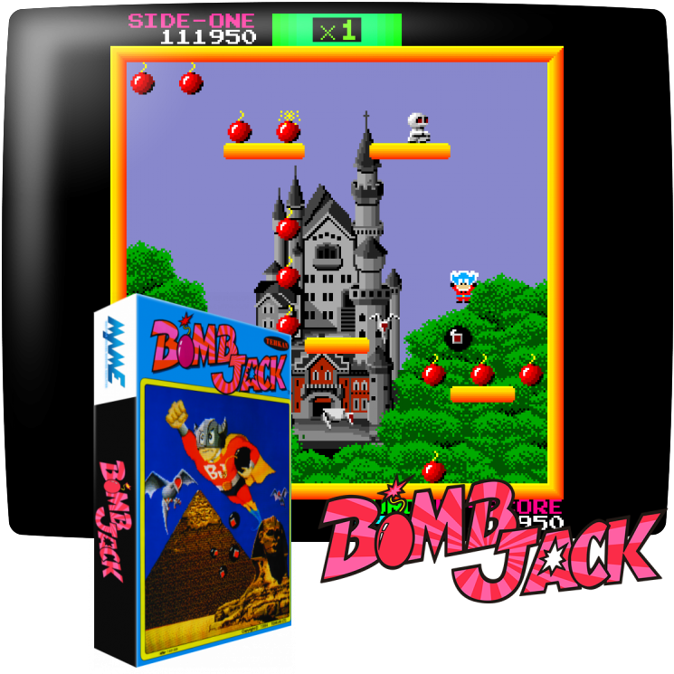
Bomb Jack is an Arcade game by Tecmo from 1984.

https://en.wikipedia.org/wiki/Bomb_Jack

Please follow the exact installation instructions from here:

https://github.com/sho3string/BombjackMEGA65

Download the Core from the MEGA65 filehost here:

https://files.mega65.org/?id=f3ddcbd5-a6c1-42cd-aa9c-db25dfd71c90

## Bosconian
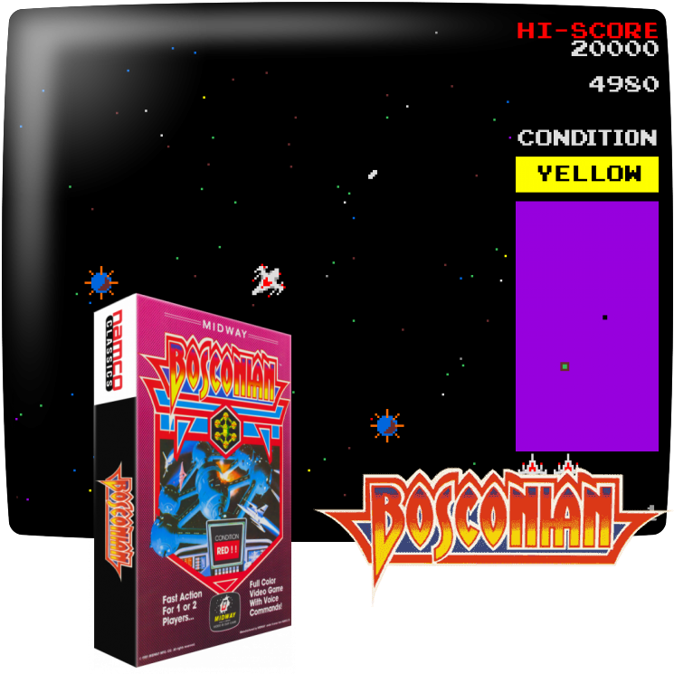
Bosconian is an Arcade game by Capcom from 1985.

https://en.wikipedia.org/wiki/Bosconian

Please follow the exact installation instructions from here:

https://github.com/sho3string/BosconianMEGA65

Download the Core from the MEGA65 filehost here:

https://files.mega65.org/?id=96dd324b-d611-4252-bea4-0dbc4eb899ae

## Burnin Rubber
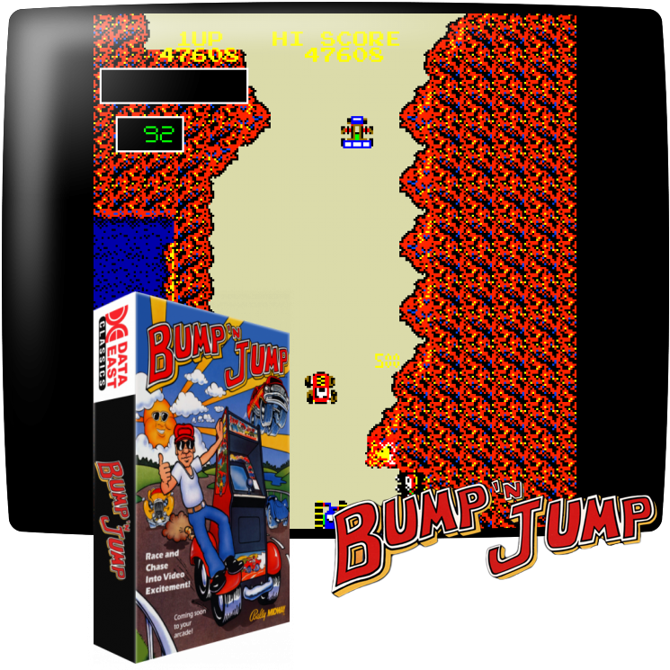
Burnin Rubber is an Arcade game by Data East from 1982. Outside of Japan it is called **Bump 'n' Jump**.

https://en.wikipedia.org/wiki/Bump_%27n%27_Jump

Please follow the exact installation instructions from here:

https://github.com/sho3string/BurningRubberMEGA65

Download the Core from the MEGA65 filehost here:

https://files.mega65.org/?id=6a96f6de-2673-40c0-9304-5720fe8ce144

_Please note that the Core does not support the US version of this arcade game, called Bump'n'Jump._

## Choplifter
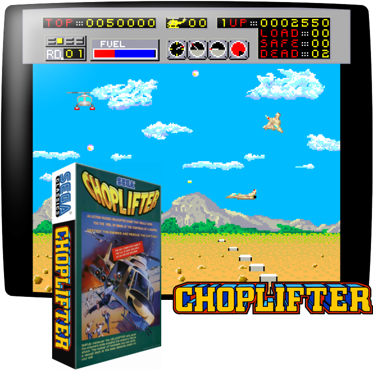
Choplifter is an Arcade game by Sega from 1985. It is based on the computer game originally for the Apple II computers from 1982 (and also ported to the C64).

https://en.wikipedia.org/wiki/Choplifter

Please follow the exact installation instructions from here:

https://github.com/sho3string/SEGASYS1MEGA65_R3

Download the Core from the MEGA65 filehost here:

https://files.mega65.org?id=3c51011a-f228-49e7-b795-2b8afe6db5fa

## Dig Dug
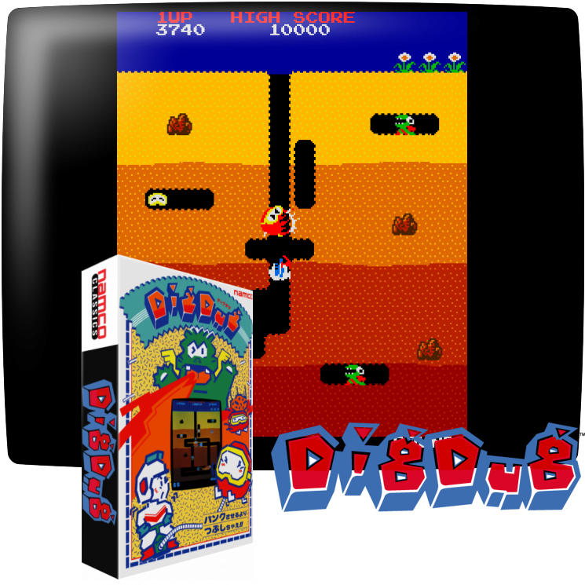
Dig Dug is an Arcade game by Namco from 1982.

https://en.wikipedia.org/wiki/Dig_Dug

Please follow the exact installation instructions from here:

https://github.com/sho3string/DigDugMEGA65_R3_R6

Download the Core from the MEGA65 filehost here:

https://files.mega65.org/?id=b5fb8733-4850-403c-a7dc-3e9a84a44b0c

## Galaga

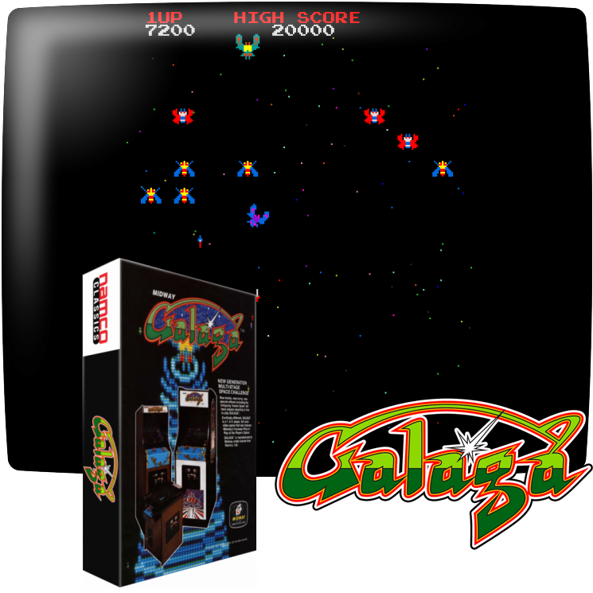
Galaga is an Arcade game by Namco from 1981.

https://en.wikipedia.org/wiki/Galaga

Please follow the exact installation instructions from here:

https://github.com/sho3string/GalagaMEGA65

Download the R3 Core from the MEGA65 filehost here:

https://files.mega65.org/?id=8bc248e3-c29c-4ba8-b8c3-6018a995a9ea

Download the R6 Core from the MEGA65 filehost here:

https://files.mega65.org?id=1672149c-66d3-4df7-9128-e9c83095c49a

## Galaxian
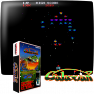
Galaxian is an Arcade game by Namco from 1979.

https://en.wikipedia.org/wiki/Galaxian

Please follow the exact installation instructions from here:

https://github.com/sho3string/GalaxianMEGA65_r3_r6/

Download the Core from the MEGA65 filehost here:

https://files.mega65.org?id=f024a865-8751-4292-ac66-439daa696ad6

## Gaplus
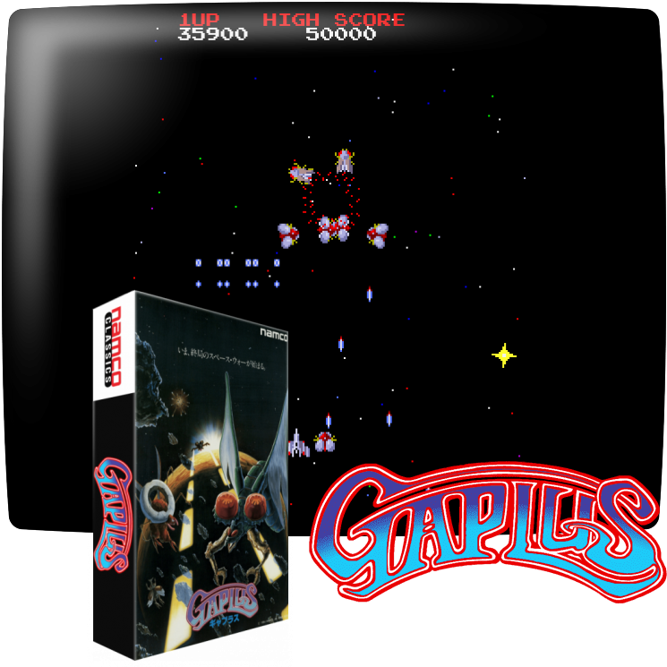
Gaplus is an Arcade game by Namco from 1984.

https://en.wikipedia.org/wiki/Gaplus

Please follow the exact installation instructions from here:

https://github.com/sho3string/GaplusMEGA65_R3_R6

Download the Core from the MEGA65 filehost here:

https://files.mega65.org?id=a87ab90e-06bc-40bb-8257-6988345d7784

## Ghosts 'n Goblins
[**This core requires different downloads based on your MEGA65 revision.**](mega65-revisions-and-cores.html)

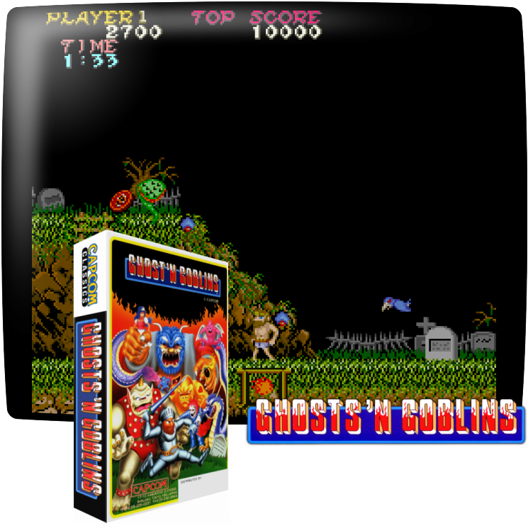
Ghosts 'n Goblins is an Arcade game by Capcom from 1985.

https://en.wikipedia.org/wiki/Ghosts_%27n_Goblins_(video_game)

Please follow the exact installation instructions from here:

https://github.com/sho3string/GnGMEGA65

Download the R3 Core from the MEGA65 filehost here:

https://files.mega65.org/?id=e563df76-e12f-47de-9bb2-cca4ebe1e18d

Download the R6 Core from the MEGA65 filehost here:

https://files.mega65.org?id=f66965dc-4006-4ebe-8fde-eed9bc60d3aa

## Green Beret / Rush'n Attack
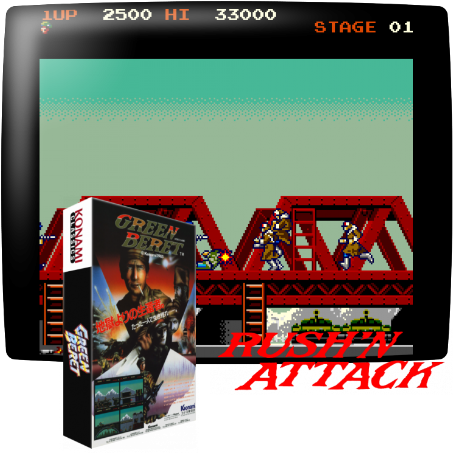
Rush'n Attack, known as Green Beret in Europe, is an Arcade game by Konami from 1985.

https://en.wikipedia.org/wiki/Rush%27n_Attack

Please follow the exact installation instructions from here:

https://github.com/sho3string/RushnAttackMEGA65_r3_r6

Download the Core from the MEGA65 filehost here:

https://files.mega65.org/?id=9c83c178-f55c-4ce2-8d0f-1aacd5ae70b4

## Gyruss
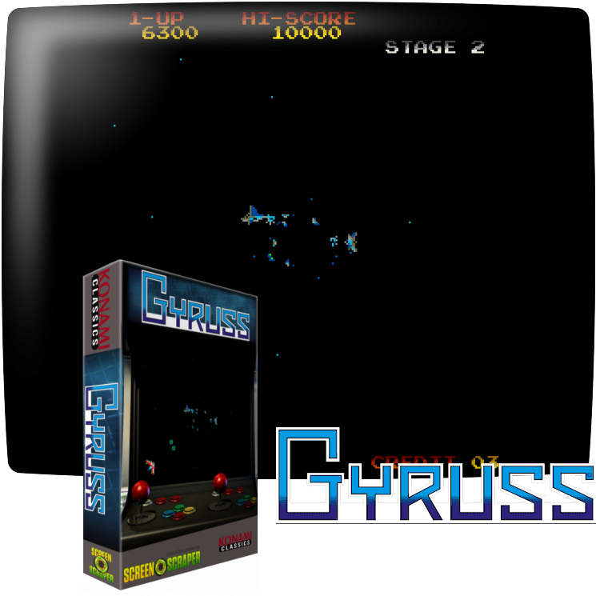
Gyruss is an Arcade game by Konami from 1983.

https://en.wikipedia.org/wiki/Gyruss

Please follow the exact installation instructions from here:

https://github.com/sho3string/GyrussMEGA65_R3_R6

Download the Core from the MEGA65 filehost here:

https://files.mega65.org?id=c1486390-3264-4027-8131-552a785cac33

## Moon Patrol
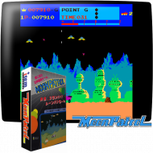
Moon Patrol is an Arcade game by Irem from 1982.

https://en.wikipedia.org/wiki/Moon_Patrol

Please follow the exact installation instructions from here:

https://github.com/sho3string/MoonPatrolMEGA65_r3_r6

Download the Core from the MEGA65 filehost here:

https://files.mega65.org?id=4a864fa1-5d65-4dd9-a5ef-dd7ce07114e8

## Mr. Do!
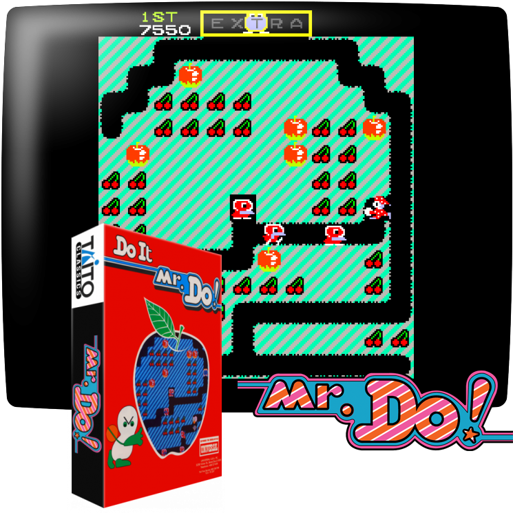
Mr. Do! is an Arcade game by Universal from 1982.

https://en.wikipedia.org/wiki/Mr._Do!

Please follow the exact installation instructions from here:

https://github.com/sho3string/MrDO_MEGA65_r3_r6/

Download the Core from the MEGA65 filehost here:

https://files.mega65.org?id=b115db76-d9a9-4a93-b751-da34c80cfe1c

## Pitfall II
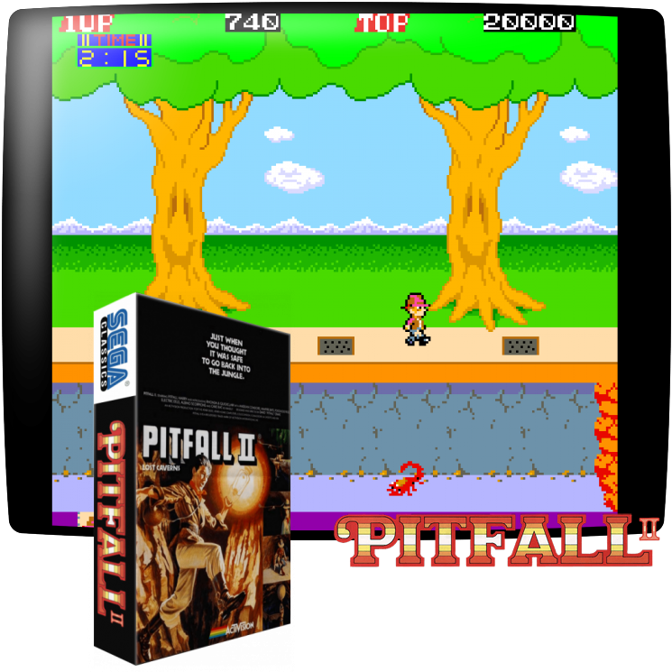
Pitfall II is an Arcade game by Sega from 1985. It is based on (but quite different to) the Pitfall-games for the Atari 2600 and C64.

https://en.wikipedia.org/wiki/Pitfall_II:_Lost_Caverns_(arcade_game)

Please follow the exact installation instructions and download the Core from here:

https://files.mega65.org?id=d1dce404-d484-472a-87ab-21755979d2fa

## Stargate
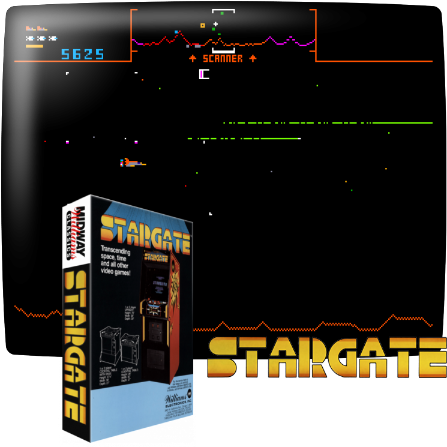
Stargate is an Arcade game by Williams from 1981.

https://en.wikipedia.org/wiki/Stargate_(1981_video_game)

Please follow the exact installation instructions from here:

https://github.com/sho3string/StargateMEGA65_R3_R6/blob/Stargate_R3_R6/README.md

Download the Core from the MEGA65 filehost here:

https://files.mega65.org?id=fb977a9b-3979-4420-99f2-c683f52070b7

## Up'n Down
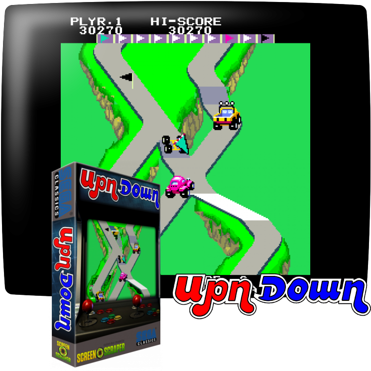
Up'n Down is an Arcade game by Sega from 1983.

https://en.wikipedia.org/wiki/Up%27n_Down

Download the Core (and read the instructions) from the MEGA65 filehost here:

https://files.mega65.org?id=dfadf67d-b55f-4c4d-8cb5-c903161e0668

## Wonder Boy / Sega System 1
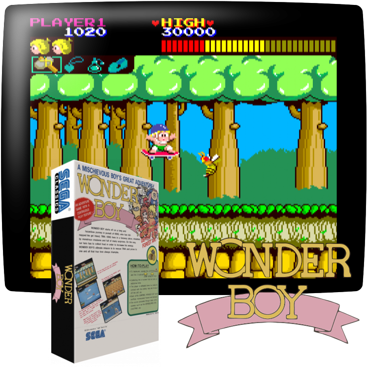
Wonder Boy is an Arcade game by Sega from 1986.

https://en.wikipedia.org/wiki/Wonder_Boy_(video_game)

Please follow the exact installation instructions from here:

https://github.com/sho3string/SEGASYS1MEGA65

Download the Core from the MEGA65 filehost here:

https://files.mega65.org/?id=7365cb17-4375-45d3-a833-a89a38266c5e

_This core potentially can run other games created for the Sega System 1, but the current release only supports the game Wonder Boy._

## Wonder Boy: Monster Land
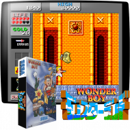
Wonder Boy is an Arcade game by Sega from 1987.

https://en.wikipedia.org/wiki/Wonder_Boy_in_Monster_Land

Please follow the exact installation instructions and download the Core from here:

https://files.mega65.org?id=77da28bd-99e0-4853-bd38-5e880078bc6d

## Xevious / Super Xevious
[**This core requires different downloads based on your MEGA65 revision.**](mega65-revisions-and-cores.html)

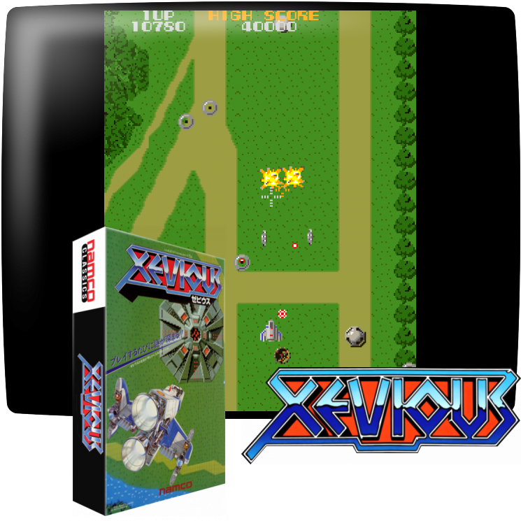
Xevious is an Arcade game by Capcom from 1985.

https://en.wikipedia.org/wiki/Xevious

Please follow the exact installation instructions from here:

https://github.com/sho3string/XeviousMEGA65

Download the R3 Core from the MEGA65 filehost here:

https://files.mega65.org/?id=d32474e9-6f30-48f8-bba3-167cad4bbc4f

Download the R6 Core from the MEGA65 filehost here:

https://files.mega65.org?id=c67076de-8dd5-4877-8c95-7a01d2cae441

_Please note that this Core supports several versions of the game, including the releases from Atari for the USA as well as Super Xevious._

# Cores Available only for R3 MEGA65

## Elevator Action (R3 only)
[**This core currently is NOT AVAILABLE for the R6 MEGA65**](mega65-revisions-and-cores.html)

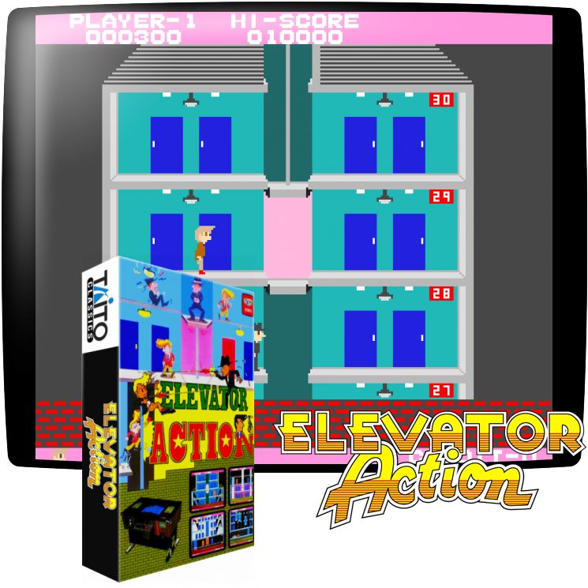
Elevator Action is an Arcade game by Taito from 1983.

https://en.wikipedia.org/wiki/Elevator_Action

Please follow the exact installation instructions from here:

https://github.com/sho3string/ElevatorActionMEGA65

Download the Core from the MEGA65 filehost here:

https://files.mega65.org/?id=e2ee129d-149c-4b59-9ced-d21185878091

# Sources
All screenshots on this page are sourced from https://screenscraper.fr
