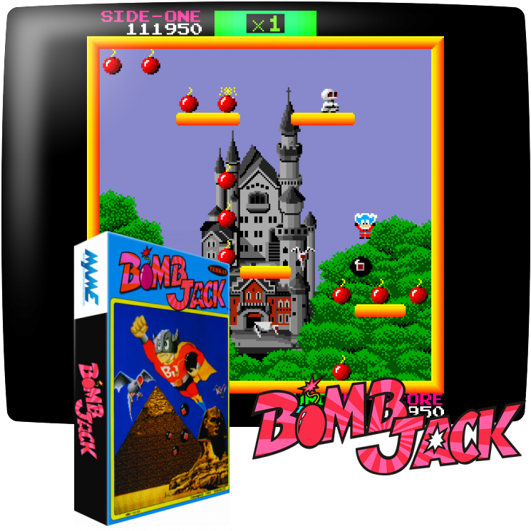
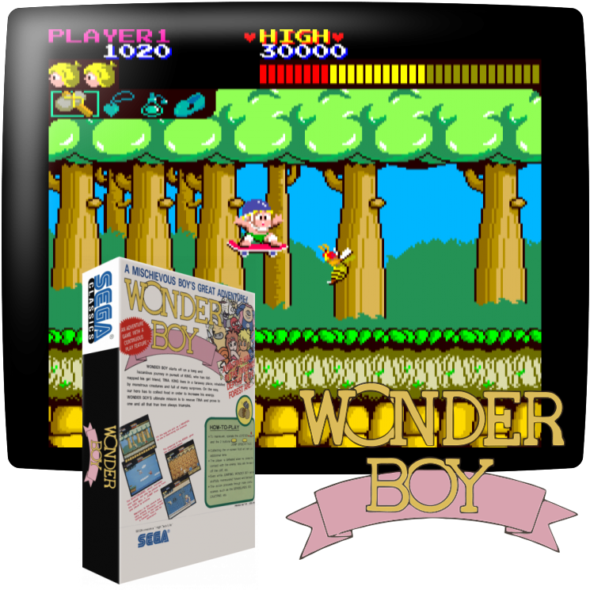
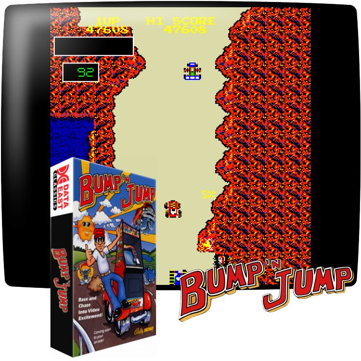
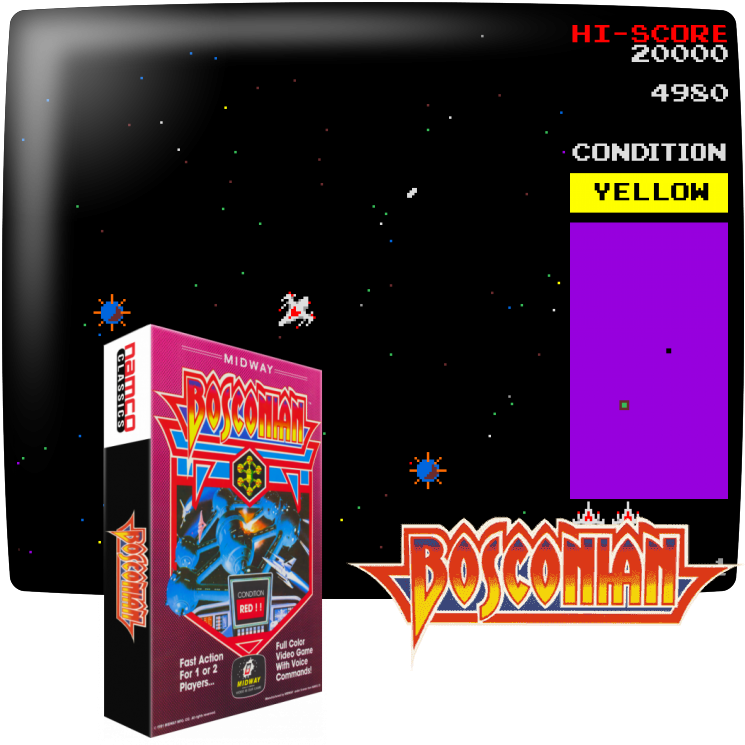

The MEGA65 can also be turned into an arcade game machine. As many early arcade games rely on fast reaction times, an FPGA-based recreation is much more faithful than software emulation. Unfortunately, arcade games usually require a complete FPGA slot for a single game.

## Important Details about Arcade Games

To recreate the game two parts are needed: An FPGA Core and image files for the ROMs. The Core is like a Core for a home computer and only has the "hardware" part of the machine. It still requires the actual software, which is a seperate file, even if the Core can only play one specific game. Arcade Game ROMs are available in many flavours on internet, but the Core usually requires a very specific format. You need to read the instructions per Core very carefully and follow them to the letter to create the correct files. This in some cases requires _Python_ on your computer. Due to copyright and licensing reasons, there is no official archive where Cores and ROMs sre bundled ready to use.

Some Arcade Machine Cores support "DIP Switches". This refers to the switches on the arcade board itself and these are shown on screen. **Do not open the MEGA65 to change the DIP switches inside.**

The Cores on this page are sorted in reverse chronological order of Core release. The newest releases are on top, the oldest on the bottom. By this you can see if there is something new.

# Cores Available for all MEGA65

## Bomb Jack

Bomb Jack is an Arcade game by Tecmo from 1984.

https://en.wikipedia.org/wiki/Bomb_Jack

Please follow the exact installation instructions from here:

https://github.com/sho3string/BombjackMEGA65

Download the Core from the MEGA65 filehost here:

https://files.mega65.org/?id=f3ddcbd5-a6c1-42cd-aa9c-db25dfd71c90

## Wonder Boy / Sega System 1

Wonder Boy is an Arcade game by Sega from 1986.

https://en.wikipedia.org/wiki/Wonder_Boy_(video_game)

Please follow the exact installation instructions from here:

https://github.com/sho3string/SEGASYS1MEGA65

Download the Core from the MEGA65 filehost here:

https://files.mega65.org/?id=7365cb17-4375-45d3-a833-a89a38266c5e

_This core potentially can run other games created for the Sega System 1, but the current release only supports the game Wonder Boy._

# Cores Available only for R3 MEGA65

## Ghosts 'n Goblins (R3 only)
[**This core currently is NOT AVAILABLE for the R6 MEGA65**](mega65-revisions-and-cores.html)

Ghosts 'n Goblins is an Arcade game by Capcom from 1985.

https://en.wikipedia.org/wiki/Ghosts_%27n_Goblins_(video_game)

Please follow the exact installation instructions from here:

https://github.com/sho3string/GnGMEGA65

Download the Core from the MEGA65 filehost here:

https://files.mega65.org/?id=e563df76-e12f-47de-9bb2-cca4ebe1e18d

## Elevator Action (R3 only)
[**This core currently is NOT AVAILABLE for the R6 MEGA65**](mega65-revisions-and-cores.html)

Ghosts 'n Goblins is an Arcade game by Taito from 1983.

https://en.wikipedia.org/wiki/Elevator_Action

Please follow the exact installation instructions from here:

https://github.com/sho3string/ElevatorActionMEGA65

Download the Core from the MEGA65 filehost here:

https://files.mega65.org/?id=e2ee129d-149c-4b59-9ced-d21185878091

## Burnin Rubber (R3 only)
[**This core currently is NOT AVAILABLE for the R6 MEGA65**](mega65-revisions-and-cores.html)

Burnin Rubber is an Arcade game by Data East from 1982. Outside of Japan it is called **Bump 'n' Jump**.

https://en.wikipedia.org/wiki/Bump_%27n%27_Jump

Please follow the exact installation instructions from here:

https://github.com/sho3string/BurningRubberMEGA65

Download the Core from the MEGA65 filehost here:

https://files.mega65.org/?id=6a96f6de-2673-40c0-9304-5720fe8ce144

_Please note that the Core does not support the US version of this arcade game, called Bump'n'Jump._

## Xevious / Super Xevious (R3 only)
[**This core currently is NOT AVAILABLE for the R6 MEGA65**](mega65-revisions-and-cores.html)

Xevious is an Arcade game by Capcom from 1985.

https://en.wikipedia.org/wiki/Xevious

Please follow the exact installation instructions from here:

https://github.com/sho3string/XeviousMEGA65

Download the Core from the MEGA65 filehost here:

https://files.mega65.org/?id=d32474e9-6f30-48f8-bba3-167cad4bbc4f

_Please note that this Core supports several versions of the game, including the releases from Atari for the USA as well as Super Xevious._

## Bosconian (R3 only)
[**This core currently is NOT AVAILABLE for the R6 MEGA65**](mega65-revisions-and-cores.html)

Bosconian is an Arcade game by Capcom from 1985.

https://en.wikipedia.org/wiki/Bosconian

Please follow the exact installation instructions from here:

https://github.com/sho3string/BosconianMEGA65

Download the Core from the MEGA65 filehost here:

https://files.mega65.org/?id=96dd324b-d611-4252-bea4-0dbc4eb899ae

## Galaga (R3 only)
[**This core currently is NOT AVAILABLE for the R6 MEGA65**](mega65-revisions-and-cores.html)

Galaga is an Arcade game by Namco from 1981.

https://en.wikipedia.org/wiki/Galaga

Please follow the exact installation instructions from here:

https://github.com/sho3string/GalagaMEGA65

Download the Core from the MEGA65 filehost here:

https://files.mega65.org/?id=8bc248e3-c29c-4ba8-b8c3-6018a995a9ea

# Sources
All screenshots on this page are sourced from https://screenscraper.fr
