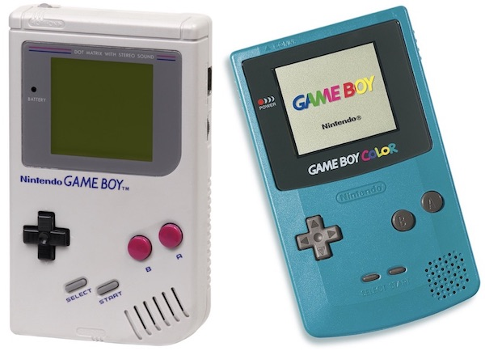
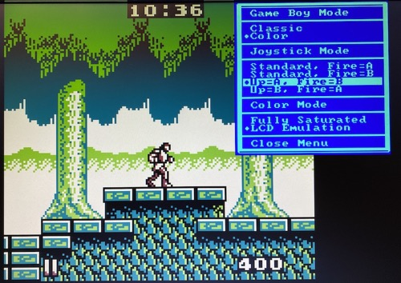

# Cores Available for all MEGA65

Currently no Core for Game Consoles is available for the R6 models.

# Cores Available for R3 models of MEGA65

## Game Boy / Game Boy Color

The Game Boy is a portable game console released by Nintendo in 1989. It was followed by the backwards compatible Game Boy Color in 1998. It is best known for making Tetris a pop culture phenomenon in the early Nineties.

https://en.wikipedia.org/wiki/Game_Boy

This early Core for the MEGA65 has some minor shortcomings. As C64-Joysticks officially only have one button, you can map the Game Boy buttons <kbd>A</kbd> or <kbd>B</kbd> to <kbd>Joystick Up</kbd> so that you can play jump and run games as you would on a C64. All Game Boy buttons, including <kbd>Start</kbd> and <kbd>Select</kbd> can be pressed via the MEGA65 keyboard.

The Core can load ROM files for the Game Boy and Game Boy Color. It features an unlicensed BIOS that can be replaced by the user with official BIOS files.
	
For further instructions please read:

https://github.com/sy2002/gbc4mega65/blob/master/README.md

The Core can be downloaded here:

https://files.mega65.org?id=03b68172-d6ff-49f0-971e-15bea2c6ad9a

