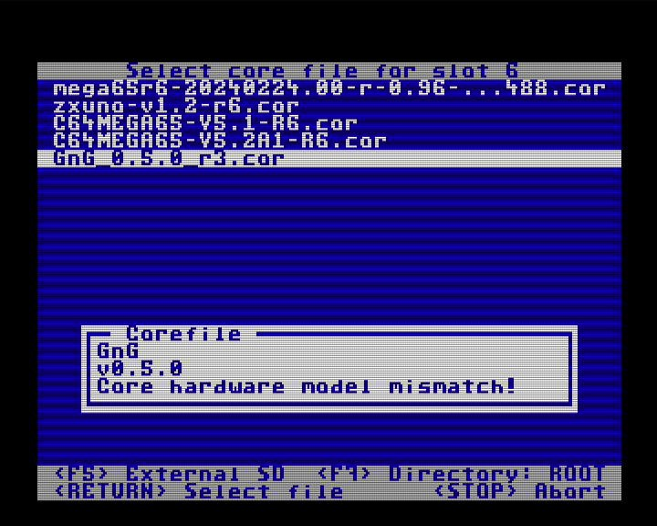

The MEGA65 was produced in several revisions that have slight internal hardware changes. Unfortunately this results in Cores needing specific versions based on your MEGA65 model.
## If you are a new MEGA65 user
All recent MEGA65 computers are **R6** models, meaning it is the sixth revision of the hardware. If your MEGA65 was shipped to you in 2024 or later and if it has a serial number higher than 1000, you are in the **R6** group.
The bad news: Some Cores might not be fully adapted to the R6 model yet and can't be installed.
## If you already had a MEGA65 before 2024
Most likely you do have a **R3** model (there are others but if you have on of these you definitely know what kind of machine you have). Currently every released Core is available for R3 models and should also be in the future. So, if a core is available in two versions, use the R3 version. Cores for other models can't be installed.
## How to be really sure about your MEGA65
When you turn on the MEGA65 in the native MEGA65 core, press the <kbd>RESTORE</kbd> key for two seconds and enter the "freezer". Now press the <kbd>HELP</kbd> key to enter the "Megainfo". Your board revision will be shown on the screen as "MEGA65 MODEL".

## How to find the correct Core files
Most alternative Cores come in a .ZIP file that contains specific files for the board revisions and have **R3** or **R6** in the filename. Just pick the right one. Some cores even have specific versions for other Rx models.
## Can I damage my MEGA65 with a wrong core?
With all known Cores it is not possible to install them when they are not the correct version. You will get a "Core hardware model mismatch!" error. Even if that mechanism fails, the Core should not damage the MEGA65. Make sure you do not install a Core into Slot 0, which has the fail-safe system to always install a correct Core into slots 1 to 7.

